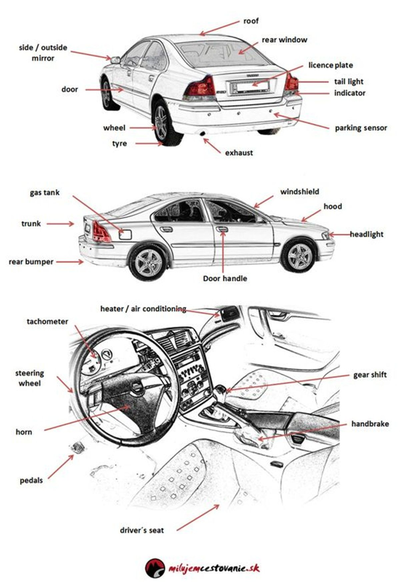
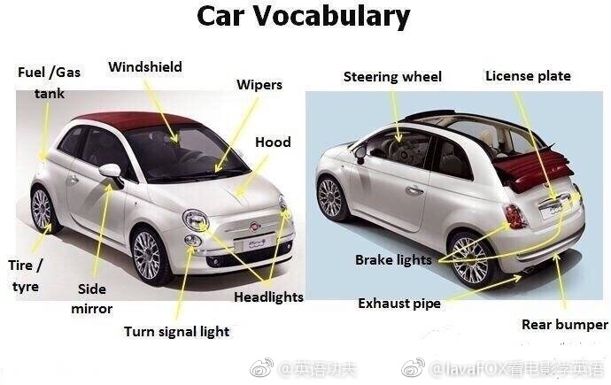
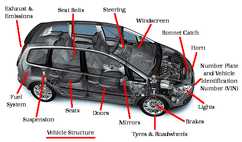
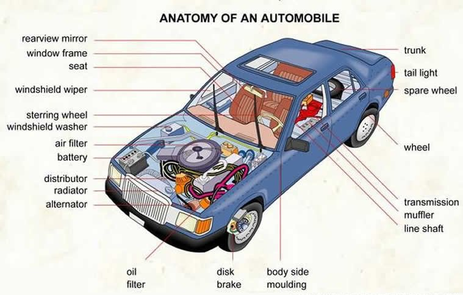

= 每周词汇(2019年43周)

.汽车{counter2:index:0}
[cols="1,4,4,4", options="header"]
|===
|序号
|词汇
|音标
|汉意

|{counter:index}
|automobile
|/ˌɔtəmə'bil/
|汽车

|{counter:index}
|roof
|/ruf/
|车顶

|{counter:index}
|rear window
|/rɪr/
|后车窗

|{counter:index}
|licence plate
|/ˈlaɪsəns/ /plet/
|车牌

|{counter:index}
|side/outside mirror
|/'mɪrɚ/
|(外)后视镜

|{counter:index}
|wheel
|/wil/
|车轮

|{counter:index}
|spare wheel
|/spɛr/ /wil/
|备胎

|{counter:index}
|tyre / tire
|/taɪr/
|轮胎

|{counter:index}
|hubcap
|/'hʌb'kæp/
|轮毂罩

|{counter:index}
|tail light
|/tel/
|尾灯

|{counter:index}
|indicator
|/'ɪndɪketɚ/
|转向指示灯

|{counter:index}
|parking sensor
|/'sɛnsɚ/
|泊车传感器(雷达)

|{counter:index}
|exhaust
|/ɪɡ'zɔst/
|排气装置

|{counter:index}
|emission
|/ɪ'mɪʃən/
|排放物、尾气

|{counter:index}
|exhaust pipe
|/ɪɡ'zɔst/ /paɪp/
|排气管

|{counter:index}
|gas tank
|/ɡæs/ /tæŋk/
|油箱

|{counter:index}
|trunk
|/trʌŋk/
|树干、后备箱

|{counter:index}
|bumper
|/'bʌmpɚ/
|缓冲器、保险杠

|{counter:index}
|rear bumper
|/rɪr/ /'bʌmpɚ/
|后保险杠

|{counter:index}
|hood
|/hʊd/
|盖子、罩子、引擎盖

|{counter:index}
|windshield
|/'wɪndʃild/
|挡风玻璃

|{counter:index}
|windscreen
|/'wɪndskrin/
|挡风玻璃

|{counter:index}
|headlight
|/'hɛdlaɪt/
|前灯

|{counter:index}
|tachometer
|/tæ'kɑmɪtɚ/
|转速表、流速计

|{counter:index}
|steering wheel
|/'stɪrɪŋ/ /wil/
|方向盘

|{counter:index}
|horn
|/hɔrn/
|报警器、喇叭

|{counter:index}
|pedal
|/'pɛdl/
|踏板

|{counter:index}
|brake
|/brek/
|刹车

|{counter:index}
|brake pedal
|/brek/ /'pɛdl/
|刹车踏板

|{counter:index}
|brake light
|/brek/ /laɪt/
|刹车灯

|{counter:index}
|gas pedal
|/ɡæs/ /'pɛdl/
|油门踏板

|{counter:index}
|handbrake
|/'hændbrek/
|手刹

|{counter:index}
|gear shift
|/ɡɪr/ /ʃɪft/
|档把

|{counter:index}
|wiper
|/'waɪpɚ/
|雨刮器

|{counter:index}
|antenna
|/æn'tɛnə/
|天线

|{counter:index}
|rearview mirror
|/'riəvju:/ /'mɪrɚ/
|后视镜

|{counter:index}
|window frame
|/'wɪndo/ /frem/
|窗框

|{counter:index}
|air filter
|/ɛr/ /'fɪltɚ/
|空气过滤器

|{counter:index}
|oil filter
|/ɔɪl/ /'fɪltɚ/
|滤油器；机油滤清器

|{counter:index}
|distributor
|/dɪ'strɪbjətɚ/
|汽车配电器

|{counter:index}
|radiator
|/'redɪ'etɚ/
|散热器、冷却器

|{counter:index}
|alternator
|/'ɔltɚnetɚ/
|交流发电机

|{counter:index}
|transmission
|/træns'mɪʃən/
|变速器

|{counter:index}
|muffler
|/'mʌflɚ/
|消声器

|{counter:index}
|line shaft
|/laɪn/ /ʃæft/
|传动轴

|{counter:index}
|body side moulding
|/'bɑdi/ /saɪd/ /'moldɪŋ/
|防擦条

|{counter:index}
|disk brake
|/dɪsk/ /brek/
|盘式制动器；碟式刹车器

|{counter:index}
|suspension
|/sə'spɛnʃən/
|悬架

|{counter:index}
|bonnet catch
|/'bɑnət/ /kætʃ/
|引擎盖安全扣
|===

'''

[appendix]
== 系列图片

.auto anatomy1

.auto anatomy2

.auto anatomy3
image::images/D62sAxVjXZXV9U5sv9VcIJhL6.jpg[float="left"]

.auto anatomy4

.auto anatomy5

