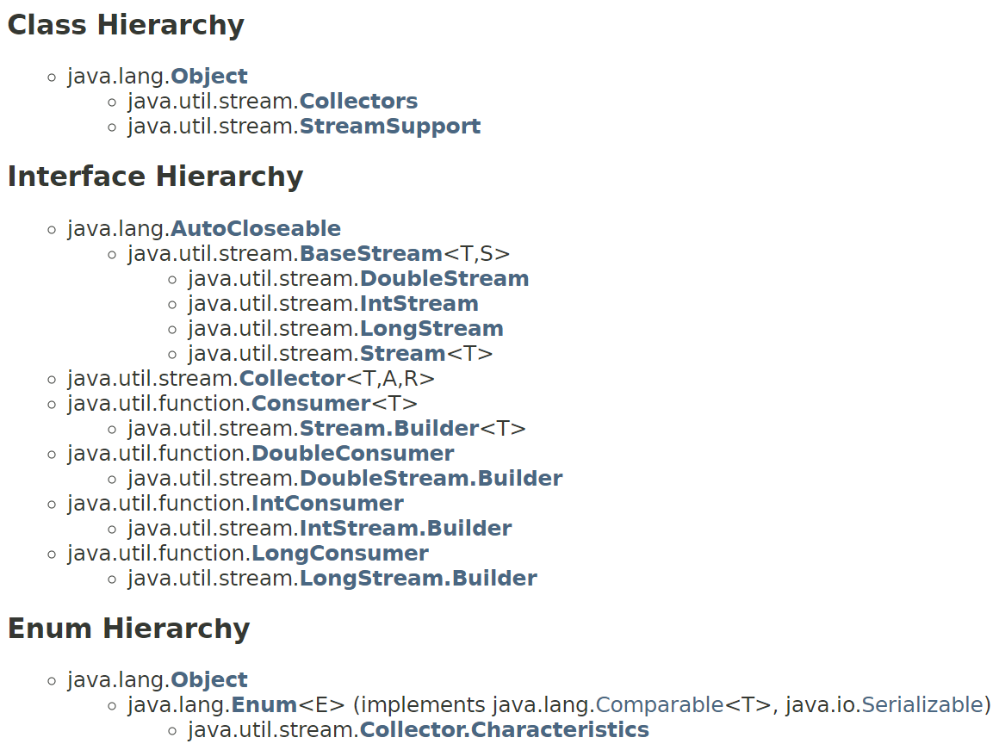
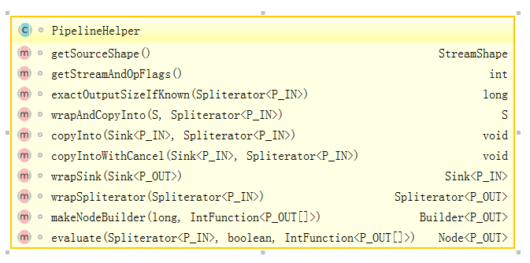

= Stream API
Wen
:doctype: article
:encoding: utf-8
:lang: cn
:toc: left
:toc-level: 4
:toc-title: 目录
:sectnums:
:nofooter:
:last-update-label!:
:icons: font
:appendix-caption: 附录
:official: link:https://docs.oracle.com/javase/tutorial/java/javaOO/lambdaexpressions.html[官方lambda文档, window="_blank"]
:api-doc: link:https://docs.oracle.com/javase/8/docs/api/index.html?java/util/stream/package-tree.html[官方API文档,window="_blank"]
:resource2: link:http://www.oracle.com/technetwork/articles/java/ma14-java-se-8-streams-2177646.html[resoure2, window="_blank"]

== 资源

- {official}

== 概览

集合在Java中使用得十分频繁，很多时候都在循环-处理这样的流程。以一个操作数据的常见SQL为例``SELECT id, MAX(value) from transactions``, 期望结果是显而易见的，如果使用集合相关API操作的话，少不了循环-排序-取值。于是，从JDK8开始，引入Stream API用于简化和强化集合操作。
另外，针对真正非常大的集合数据，如何高效地处理？如果能充分利用计算机的多核心的话，就能够达到，但是曾经使用Java编写并行代码，困难且易错。

以一个常见的集合处理场景为例：从一组交易记录(transactions)中，找出类型为grocery的记录，并且按交易值倒序的那些记录。

.传统方式
====
[source,java]
----

List<Transaction> groceryTransactions = new Arraylist<>();
for(Transaction t: transactions){
  if(t.getType() == Transaction.GROCERY){
    groceryTransactions.add(t);
  }
}
Collections.sort(groceryTransactions, new Comparator(){
  public int compare(Transaction t1, Transaction t2){
    return t2.getValue().compareTo(t1.getValue());
  }
});
List<Integer> transactionIds = new ArrayList<>();
for(Transaction t: groceryTransactions){
  transactionsIds.add(t.getId());
}
----
====

.Stream API方式
====
[source,java]
----
List<Integer> transactionsIds = 
    transactions.stream()
                .filter(t -> t.getType() == Transaction.GROCERY)
                .sorted(comparing(Transaction::getValue).reversed())
                .map(Transaction::getId)
                .collect(toList());
----
====

上面代码处理流程可以通过下图表示

image::images/EQ5G8dt9&Kf!.png[流程示意图]

首先，从list中通过``stream()``得到一个stream，接下来，通过一组操作(filter,sorted,map,collect)连接成一个处理的pipeline，可以被当作对数据的一个query。

.并行化处理
====
[source,java]
----
List<Integer> transactionsIds = 
    transactions.parallelStream()                                       <1>
                .filter(t -> t.getType() == Transaction.GROCERY)
                .sorted(comparing(Transaction::getValue).reversed())
                .map(Transaction::getId)
                .collect(toList());
----
<1> 通过``parallelStream()``就可以对stream进行并行处理
====

=== 定义(Definition)

那么，通过上面的例子，可以讲讲什么是Stream。字面的定义是：

[quote]
--
a sequence of elements from a source that supports aggregate operations
--

如图

image::images/dVeT84F&2cu.png[]

这个定义包括

- **Sequence of elements**: A stream provides an interface to a sequenced set of values of a specific element type. However, streams don’t actually store elements; they are computed on demand.
- **Source**: Streams consume from a data-providing source such as collections, arrays, or I/O resources
- **Aggregate operations**: Streams support SQL-like operations and common operations from functional programing languages, such as filter, map, reduce, find, match, sorted, and so on.

另外，stream操作有两个基本特征是集合所不具备的

- **Pipelining**: Many stream operations return a stream themselves. This allows operations to be chained to form a larger pipeline. This enables certain optimizations, such as laziness and short-circuiting, which we explore later.
- **Internal iteration**: In contrast to collections, which are iterated explicitly (external iteration), stream operations do the iteration behind the scenes for you. 

下图展示了更多地细节

image::images/707521b17462b5d857cb0f0ead9eb64e166d99d9.png[] 

=== 对比(Stream vs Collection)

那么，stream和collection的差别是什么呢？简要来说，##collections are about data and streams are about computations##。

不那么严谨地说，Collection要求用户自己进行迭代操作(所谓external iteration)； 

而stream使用internal iteration，使用者只需要提供各种function告诉stream要做什么。

=== API概览

.stream api overview
 

可以看到Collectors和StreamSupport是两个工具类。

=== 包结构

主要的类和接口都位于 java.util.stream包中，结构图如下

.java.util.stream包
image::images/7d413cb435bfde9f85e7e729d2aead5f0d0e4bad.png[] 

可以看到位于顶端的是一个接口BaseStream和一个抽象类PipelineHelper，它们定下了stream的基本逻辑：
Stream持有数据结构，PipelineHelper用于数据处理

.BaseStream
image::images/7a2f385f213bf726cdf803ef3cf2614d3054b80f.png[] 

.PipelineHelper(这是一个non-public的类)

== 常用操作(Stream operations)

根据{api-doc}，可以看到stream支持的所有操作，列举在<<appxa>>中。

这些操作分为两种类型：intermediate和terminal。

- intermediate: 各种能将返回类型为stream的操作连在一起形成pipeline的操作，比如filter,sorted,map,distinct等，
重要的是，intermediate并不会立即对数据做任何操作，这被称为##lazy##
- terminal: 会关闭stream的操作被称为terminal。它们从一个pipeline产生一个结果，比如List, Integer，甚至void。只有terminal操作被调用的时候，一个pipeline才会进行真正的处理。

.示例说明
====
[source, java]
----
List<Integer> numbers = Arrays.asList(1, 2, 3, 4, 5, 6, 7, 8);
List<Integer> twoEvenSquares = 
    numbers.stream()
       .filter(n -> {
                System.out.println("filtering " + n); 
                return n % 2 == 0;
              })
       .map(n -> {
                System.out.println("mapping " + n);
                return n * n;
              })
       .limit(2)                                               <1>
       .collect(toList());
----
<1> limit(2)是一个``short-circuiting``；这样，仅仅处理部分stream，而无需所有。类似Boolean表达式中的AND操作符：只要一个expression为false，立刻返回，而无需计算剩余表达式。

[source, screen]
----
打印结果

filtering 1
filtering 2
mapping 2
filtering 3
filtering 4
mapping 4
----
====

[NOTE]
--
粗略来说，stream的操作属于filter-map-reduce模型，可以视作类似于fork-join。所以stream的操作中，组成pipeline的基本操作包括filter,find,match等操作属于intermediate，而forEach,max,toList等操作属于terminal。stream属于何种类别，都在附表A中进行了标注。
--

=== intermediate操作

==== Filtering(过滤)

包括##filter##, ##distinct##, ##limit##和##skip##这4个操作

这一类操作对stream进行过滤之后，仍然返回stream。例如

.filtering示例
====
[source,java]
----
Stream.of("one", "two", "three", "four","three")
  .distinct()                                      <1>
  .filter(s -> s.contains("o"))                    <2>
  .skip(1)                                         <3>
  .limit(1)                                        <4>
  .forEach(System.out::println);
----
<1> *distinct*: Takes a predicate (java.util.function.Predicate) as an argument and returns a stream including all elements that match the given predicate
<2> *filter(Predicate)*: Returns a stream with unique elements (according to the implementation of equals for a stream element)
<3> *skip(n)*: Returns a stream that is no longer than the given size n
<4> *limit(n)*: Returns a stream with the first n number of elements discarded
====

==== Sorting(排序)

对stream元素进行排序，包括两个方法

- `Stream<T> sorted()`: sorted stream according to natural order
- `Stream<T> sorted(Comparator<? super T> comparator)`: sorted according to the provided Comparator

.sorting示例
====
[source,java]
----
Stream.of("one", "two", "three", "four","three")
  .sorted()                                        <1>
  .forEach(System.out::println);
  
Stream.of("one", "two", "three", "four","three")
  .sorted((o1, o2) -> o1.compareTo(o2))            <2>
  .forEach(System.out::println);
----
<1> 自然排序
<2> 提供排序算法
====

==== Mapping(映射)

映射操作分为map和flatMap两类，每种类型都包括3个快捷操作映射到Double,Long和Int类型。各自的方法签名如下：

map::
- ``<R> Stream<R> map(Function<? super T,? extends R> mapper)``
- ``DoubleStream mapToDouble(ToDoubleFunction<? super T> mapper)``
- ``IntStream mapToInt(ToIntFunction<? super T> mapper)``
- ``LongStream mapToLong(ToLongFunction<? super T> mapper)``
flatmap::
- ``<R> Stream<R> flatMap(Function<? super T,? extends Stream<? extends R>> mapper)``
- ``DoubleStream flatMapToDouble(Function<? super T,? extends DoubleStream> mapper)``
- ``IntStream flatMapToInt(Function<? super T,? extends IntStream> mapper)``
- ``LongStream flatMapToLong(Function<? super T,? extends LongStream> mapper)``

可以看出，map和flatMap的差别在于

map接受的Function类型参数做的事情是在stream的元素类型T和返回的stream元素类型R之间做了一个映射，这种映射是一对一的；  

而flatMap接受的Function类型参数所做的是在stream的元素类型T和返回类型R所构成的stream之间做了映射，很显然，这种映射是一对多的，也就是说，如果stream的元素类型是一个集合的话，通过flatMap，可以将这些集合展开(flat)。

.mapping示例
====
[source,java]
----
Stream.of("one", "two", "three", "four","three")
  .map(String::toUpperCase)
  .forEach(System.out::println);
  
Stream.of(Arrays.asList("MySQL", "Mongo", "PostgreSQL"),
  Arrays.asList("Java", "C++", "Swift"))
  .flatMap(element -> element.stream().filter(s -> s.length() > 5))
  .forEach(System.out::println);
----
====

可以看到，flatMap在过滤一对多的情况时，会非常有帮助。

==== Peek(查看)

这个操作和forEach对应，差别在于forEach是terminal操作，而peek属于intermediate。其方法签名为

- `Stream<T> peek(Consumer<? super T> action)`

根据API文档，这个操作主要用于调试，可以将元素打印出来，例如

.peek示例
====
[source,java]
----
 Stream.of("one", "two", "three", "four")
     .filter(e -> e.length() > 3)
     .peek(e -> System.out.println("Filtered value: " + e))      <1>
     .map(String::toUpperCase)
     .peek(e -> System.out.println("Mapped value: " + e))
     .collect(Collectors.toList());
----
<1> 如果这里换做forEach的话，后续操作是无法进行的
====

==== Sequential, Parallel, Unordered

这三个操作都继承自BaseStream。

[quote, 官方API文档]
--
Stream pipelines may execute either sequentially or in parallel. This execution mode is a property of the stream. Streams are created with an initial choice of sequential or parallel execution. (For example, Collection.stream() creates a sequential stream, and Collection.parallelStream() creates a parallel one.) This choice of execution mode may be modified by the BaseStream.sequential() or BaseStream.parallel() methods, and may be queried with the BaseStream.isParallel() method.
--

可以看出这三个操作均和stream的运行模式(execution mode)有关，sequential和parallel用于在并行和串行间切换。

而unordered则用于在并行情况下，提高运行效率

[quote, 官方API文档]
--
For sequential streams, the presence or absence of an encounter order does not affect performance, only determinism. If a stream is ordered, repeated execution of identical stream pipelines on an identical source will produce an identical result; if it is not ordered, repeated execution might produce different results.
For parallel streams, relaxing the ordering constraint can sometimes enable more efficient execution.

In cases where the stream has an encounter order, but the user does not particularly care about that encounter order, explicitly de-ordering the stream with unordered() may improve parallel performance for some stateful or terminal operations.
--

=== terminal操作

只有terminal类型操作才会真正开启对stream的处理，此后，stream就无法再被其他操作使用了

==== Matching(匹配)

用于匹配判定，包括三个方法

- `boolean allMatch(Predicate<? super T> predicate)`: 全部匹配
- `boolean anyMatch(Predicate<? super T> predicate)`: 任意匹配
- `boolean noneMatch(Predicate<? super T> predicate)`: 无匹配

根据方法签名的名称，可以看出三个操作各自用途，根据predicate，返回true或者false，

.matching示例
====
[source,java]
----
System.out.println("result is : " + Stream.of("one", "two", "three", "four")
  .allMatch(s -> s instanceof String));
----
====

==== Finding(查找)

用来查找stream中的元素，包括两个操作

- `Optional<T> findFirst()`: 找到第一个
- `Optional<T> findAny()`: 找到任一个

可以看到，这两个操作均返回一个包装类型 ##Optional<T>##，是一种容器类，用来表示一个值是否存在(关于Optional类的说明，参见<<appxb>>)。

.finding示例
====
[source,java]
----
Optional<String> = 
Stream.of("one", "two", "three", "four")
  .findAny();                               <1>
----
<1> findAny操作属于一个short-circuiting 操作，即只要发现匹配，立刻终止操作并返回，而且出于性能考虑，这个操作返回结果是随机的。
====

==== Iterating(迭代)

遍历stream的每个元素，并执行操作，这个操作包括两个方法签名

- `void forEach(Consumer<? super T> action)`
- `void forEachOrdered(Consumer<? super T> action)`

一般认为，forEach 和常规 for 循环的差异不涉及到性能，它们仅仅是风格的差别

这是一个terminal操作，接受一个Consumer类型作为参数，可以对每个元素执行某种操作。和forEachOrdered的差别在于后者
##processes the elements one at a time##。

==== Reduction(消减)

reduction操作，又称作fold，接受一系列输入元素，通过重复应用某种组合操作(combining operation)，输出单一结果(summary result)，诸如给出一组数值的和或者最大值，或者将元素累计到一个list中。stream包括的reduction操作包括

. reduce
. collect
. sum
. max
. count

===== reduce

- `Optional<T> reduce(BinaryOperator<T> accumulator)`
- `T reduce(T identity, BinaryOperator<T> accumulator)`
- `<U> U reduce(U identity, BiFunction<U,? super T,U> accumulator, BinaryOperator<U> combiner)`

可以看到，reduce主要操作都由传入的二元操作符BinaryOperation决定。而这个BinaryOperation需要的实现来自BiFunction的接口方法apply，实际提供的是如何设定stream中前后两个元素的关联操作，然后将这种操作复制到所有元素上，例如

.reduce示例(一个参数)
====
[source,java]
----
Stream.of("one", "two", "three", "four")
  .reduce(new BinaryOperator<String>() {
    @Override
    public String apply(String s, String s2) {     <1>
      return s.concat("," + s2);                   <2>
      return s.concat(",");                        <3>
      return ","+s2;                               <4>
    }
  }).ifPresent(System.out::println);
----
<1> ``s``和``s2``分别代表上次计算结果和当前元素
<2> 输出``one,two,three,four``
<3> 输出``one,,,``。如果``s``没有被使用，那意味着始终没有上次计算结果
<4> 输出``four,``。如果``s2``没被使用，那意味着除了第一个元素，剩余元素都未被使用
====

.reduce示例(二个参数)
====
[source,java]
----
System.out.println(
Stream.of("one", "two", "three", "four")
  .filter(s -> s.length() > 3)
  .reduce("ccc", (s, s2) -> s.concat(",").concat(s2)));    <1><2><3>
----
<1> 具有两个参数的reduce操作，第一个参数是 `T identity`, 代表初始值
<2> 输出``ccc,three,four``
<3> 因为存在初始值，所以此方法返回值不需要包装类型``Optional``
====

而具有三个参数的reduce操作，根据官方文档

`combiner.apply(u, accumulator.apply(identity, t)) == accumulator.apply(u, t)`  
究竟是什么意思呢？

.reduce示例(三个参数)
====
[source,java]
----
System.out.println(
        Stream.of(1, 2, 3, 4)
                .reduce(0, (n1, n2) -> n1+n2, (p1, p2) -> p1*p2)        <1>
);
System.out.println(
        Stream.of(1, 2, 3, 4)
                .parallel()
                .reduce(0, (n1, n2) -> n1+n2, (p1, p2) -> p1*p2)        <2>
);
----
<1> 输出结果10，也就是说combiner完全没用
<2> 输出为24，在parallel模式下，工作的是combiner
====
 
      
===== collect

collect是很有用的操作，用于将元素收集到另一个不同的集合里作为结果，有两个方法签名

- `<R,A> R collect(Collector<? super T,A,R> collector)`
- `<R> R collect(Supplier<R> supplier,BiConsumer<R,? super T> accumulator,BiConsumer<R,R> combiner)`

它的概念如下
[quote, 官网文档]
--
Collector is specified by four functions that work together to accumulate entries into a mutable result container, and optionally perform a final transform on the result. They are:

- creation of a new result container (`supplier()`)
- incorporating a new data element into a result container (`accumulator()`)
- combining two result containers into one (`combiner()`)
- performing an optional final transform on the container (`finisher()`)

--

Java8提供多种内置collectors，可以通过Collectors的静态方法获得(参考<<appxc>>)，因此，大多数情况下使用第一种方法就可以了，比如

.collect示例
====
[source,java]
----
Stream.of("one", "two", "three", "four")
    .collect(Collectors.toList())
    .forEach(System.out::println);
----
====

===== max|min

都是一种特殊的reduction操作，根据指定的comparator排序。

- `Optional<T> max(Comparator<? super T> comparator)`
- `Optional<T> min(Comparator<? super T> comparator)`

.max示例
====
[source,java]
----
Stream.of("one", "two", "three", "four")
  .max((o1, o2) -> o1.compareTo(o2) > 0 ? -1:1)
  .ifPresent(System.out::println);
----
====

===== count

返回stream中元素数量

- ``long count()``

==== toArray

- ``Object[] toArray()``
- ``<A> A[] toArray(IntFunction<A[]> generator)``

toArray是实例方法——将当前stream转换为Array。例如

.toArray示例
====
[source,java]
----
Arrays.stream(
Stream.generate(() -> UUID.randomUUID().toString())
  .limit(5)
  .toArray()).forEach(System.out::println);
----
====

如果希望返回确定的类型，则要用到第二种方法，根据方法签名，可以看到IntFunction泛型是``A[]``，而接口IntFunction定义为

[source,java]
----
@FunctionalInterface                   <1>
public interface IntFunction<R> {
    R apply(int value);
}
----
<1> 函数接口

所以，可以这样使用

[source,java]
----
Person[] men = people.stream()
      .filter(p -> p.getGender() == MALE)
      .toArray(value -> new Person[value]);
----

更进一步简化为

[source,java]
----
Person[] men = people.stream()
      .filter(p -> p.getGender() == MALE)
      .toArray(Person[]::new);                 <1>
----
<1> 方法引用(Method Reference), java8特性之一

==== 其他操作

===== empty

- `static <T> Stream<T> empty()`

这个方法返回一个空的stream。很显然，其设计目的就是为了避免NPE，而在一些需要返回stream类型的地方作为填充对象使用的。

===== concat

- `static <T> Stream<T> concat(Stream<? extends T> a, Stream<? extends T> b)`

将两个stream拼凑起来，第二个stream的元素会跟在第一个stream的后面，如果两个stream都是ordered的，那么拼凑的stream也是排好序的，如果其中一个是parallel的，那么拼凑的stream就是parallel的。只有当拼凑的stream关闭的时候，两个输入stream才会关闭。

== Stream construction(构造方法)

=== built-in(内置)

了解了stream支持的操作之后，看一下如果构造一个stream。通过之前的例子可以看到，Stream的静态方法``of(T ..)``可以构造一个stream

==== of(T..)

- `static <T> Stream<T> of(T t)`
- `static <T> Stream<T> of(T... values)`

除了of()方法之外，Stream类还提供了其他静态方法builder,generate,iterate用于构造一个stream

==== builder()

- `static <T> Stream.Builder<T> builder()`

返回一个Stream的builder。

查看其源码

.Stream.builder()
[source,java]
----
public static<T> Builder<T> builder() {
    return new Streams.StreamBuilderImpl<>();
}
----

可以看出实际是通过Stream的帮助类Streams的静态子类构造的。示例

.Stream.builder()
====
[source, java]
----
Stream<String> streamBuilder =
  Stream.<String>builder().add("a").add("b").add("c").build();
----
====

==== generate()

返回一个infinite,sequential,unordered的stream。元素均由Supplier产生。这个方法适合用来生成constant streams,streams of random elements等。

- `static <T> Stream<T> generate(Supplier<T> s)`

.Stream.generate()
====
[source, java]
----
int days = Period.between(start, end).getDays();

List<LocalDate> serials = Stream.iterate(start, d -> d.plusDays(1)).limit(days+1).collect(Collectors.toList());

----
====

==== iterate()

返回一个infinite,sequential,ordered的stream。迭代使用函数f和初始元素seed，生成由seed,f(seed),f(f(seed))等一系列元素组成的stream。注意UnaryOperator是一元操作符。

- `static <T> Stream<T> iterate(T seed, UnaryOperator<T> f)`

.Stream.generate()
====
[source, java]
----
Stream<Integer> streamIterated = Stream.iterate(40, n -> n + 2).limit(20);
----
====

以上两种静态方法``generate()``和``iterate()``创建的stream可以是无限(infinite)的。这意味着，这两个静态方法可以用于支持一些真正的大数据操作。

=== collection

可以通过集合类的新接口方法创建stream。比如List, Set, Map之类的``stream()``方法，

.stream()源码
[source, java]
----
default Stream<E> stream() {
    return StreamSupport.stream(spliterator(), false);
}
----

.parallelStream()源码
[source, java]
----
default Stream<E> parallelStream() {
    return StreamSupport.stream(spliterator(), true);
}
----

可以看到这两个方法都是接口默认方法。

.of()源码
[source, java]
----
public static<T> Stream<T> of(T t) {
    return StreamSupport.stream(new Streams.StreamBuilderImpl<>(t), false);
}
----

可以看出来实际都是调用StreamSupport的``stream(Streams.StreamBuilderImpl<T>, boolean)``方法。

=== array

数组的工具类Arrays也提供构造stream的静态方法

.arrays构造stream源码
[source, java]
----
public static <T> Stream<T> stream(T[] array) {
    return stream(array, 0, array.length);
}

public static <T> Stream<T> stream(T[] array, int startInclusive, int endExclusive) {
    return StreamSupport.stream(spliterator(array, startInclusive, endExclusive), false);
}
----

=== file

Java 8也提供跟File相关的构造stream的方法。

比如Files类提供几个静态方法，可以得到stream实例：

- `static Stream<Path> find(Path start, int maxDepth, BiPredicate<Path,BasicFileAttributes> matcher, FileVisitOption... options) throws IOException`
- `static Stream<String> lines(Path path)`
- `static Stream<String> lines(Path path, Charset cs)`
- `Stream<Path> list(Path dir)`
- `static Stream<Path> walk(Path start, FileVisitOption... options)`
- `static Stream<Path> walk(Path start, int maxDepth, FileVisitOption... options)`
- `static Stream<Path> list(Path dir)`

还有BufferedReader的方法：

- `Stream<String> lines()`

以及java.util.jar.JarFile提供的

- `Stream<JarEntry>	stream()`

java.uitl.zip提供的

- `Stream<? extends ZipEntry> stream()`

=== streamsupport

通过StreamSupport的一组stream方法，也可以构造stream。它提供了3对方法，支持产生基本类型的stream

- `static DoubleStream doubleStream(Spliterator.OfDouble spliterator, boolean parallel)`
- `static DoubleStream doubleStream(Supplier<? extends Spliterator.OfDouble> supplier, int characteristics, boolean parallel)`
- `static IntStream	intStream(Spliterator.OfInt spliterator, boolean parallel)`
- `static IntStream	intStream(Supplier<? extends Spliterator.OfInt> supplier, int characteristics, boolean parallel)`
- `static LongStream longStream(Spliterator.OfLong spliterator, boolean parallel)`
- `static LongStream longStream(Supplier<? extends Spliterator.OfLong> supplier, int characteristics, boolean parallel)`

以及一对方法用于提供引用类型的stream

- `static <T> Stream<T>	stream(Spliterator<T> spliterator, boolean parallel)`
- `static <T> Stream<T>	stream(Supplier<? extends Spliterator<T>> supplier, int characteristics, boolean parallel)`

至于这些方法中所需要的spliterator从何而来？Java 8提供了相应的工具类Spliterators，可以方便地构造出所需要的spliterator，当然，如果实在没有符合要求的构造方法，只能自己实现。

== Numeric Streams

通过官方文档，可以看到和Stream接口并列的还有三个支持基本类型的接口。

.主要stream类的层次
----
- java.util.stream.BaseStream<T,S>
  | - java.util.stream.DoubleStream
  | - java.util.stream.IntStream
  | - java.util.stream.LongStream
  | - java.util.stream.Stream<T>
----

=== IntStream

通过文档，可以看到一些操作诸如``allMatch(IntPredicate predicate)``,``concat(IntStream a, IntStream b)``之类，和Stream类相比，方法名称相同，只是参数适配Integer类型，那么其实作用和用法都是一样的，就不必细究。主要看一下真正不同于Stream的一些方法

- ``DoubleStream asDoubleStream()``
- ``LongStream asLongStream()``
- ``OptionalDouble average()``
- ``Stream<Integer> boxed()``
- ``<U> Stream<U> mapToObj(IntFunction<? extends U> mapper)``
- ``static IntStream	range(int startInclusive, int endExclusive)``
- ``static IntStream	rangeClosed(int startInclusive, int endInclusive)``
- ``Spliterator.OfInt spliterator()``
- ``int sum()``
- ``IntSummaryStatistics summaryStatistics()``

==== boxed

根据API文档，这个方法返回Stream，每个元素都会被boxes to Integer

==== range|rangeClosed

这两个静态方法根据两个值之间的连续整数生成一个stream，两个方法的startInclusive都是inclusive的，而endExclusive一个是exclusive的，一个是inclusive的

==== spliterator

返回一个Spliterator.OfInt类型

==== summaryStatistics

返回的类型IntSummaryStatistics是一个统计类，提供count,min,max,sum,average等指标。

==== construction

除了和Stream相似的一些Stream类的构造方法外，还有一些构造IntStream的方法，根据API文档，主要有

- ``CharSequence.chars()``
- ``CharSequence.codePoints()``
- ``CharBuffer.chars()``
- ``Random.ints()``
- ``SplittableRandom.ints()``
- ``BitSet.stream()``
- ``ThreadLocalRandom.ints()``

=== LongStream

和IntStream类似，只有asDoubleStream方法

==== construction

- ``Random.longs()``
- ``SplittableRandom.longs()``
- ``ThreadLocalRandom.longs()``

=== DoubleStream

没有range和rangeClosed方法，没有asXXXStream方法

==== construction

- ``Random.doubles()``
- ``SplittableRandom.doubles()``
- ``ThreadLocalRandom.doubles()``

[#appxa, reftext=附录A]
[appendix]
== Stream操作

.操作表
[cols="1,3,3", options="header"]
|===
|序号
| 方法签名
| 类型

|{counter:index}
| ``Stream<T> filter(Predicate<? super T> predicate)``
| intermediate

|{counter:index}
| ``Stream<T> distinct()``
| intermediate

|{counter:index}
| ``Stream<T> limit(long maxSize)`` 
| intermediate

|{counter:index}
| ``Stream<T> skip(long n)`` 
| intermediate

|{counter:index}
| `Stream<T> sorted()` 
| intermediate

|{counter:index}
| `Stream<T> sorted(Comparator<? super T> comparator)` 
| intermediate

|{counter:index}
| `<R> Stream<R> map(Function<? super T,? extends R> mapper)` 
| intermediate

|{counter:index}
| `DoubleStream mapToDouble(ToDoubleFunction<? super T> mapper)` | intermediate

|{counter:index}
| `IntStream mapToInt(ToIntFunction<? super T> mapper)` 
| intermediate

|{counter:index}
| `LongStream mapToLong(ToLongFunction<? super T> mapper)` 
| intermediate

|{counter:index}
| `<R> Stream<R> flatMap(Function<? super T,? extends Stream<? extends R>> mapper)` 
| intermediate

|{counter:index} 
| `DoubleStream flatMapToDouble(Function<? super T,? extends DoubleStream> mapper)` 
| intermediate

|{counter:index} 
| `IntStream flatMapToInt(Function<? super T,? extends IntStream> mapper)` 
| intermediate

|{counter:index} 
| `LongStream flatMapToLong(Function<? super T,? extends LongStream> mapper)` 
| intermediate

|{counter:index}
| `Stream<T> peek(Consumer<? super T> action)` 
| intermediate

|{counter:index} 
| `S parallel()` 
| intermediate

|{counter:index}
| `S sequential()` 
| intermediate

|{counter:index}
| `S unordered()` 
| intermediate

|{counter:index}
| `boolean allMatch(Predicate<? super T> predicate)` 
| terminal

|{counter:index}
| `boolean anyMatch(Predicate<? super T> predicate)` 
| terminal 

|{counter:index}
| `boolean noneMatch(Predicate<? super T> predicate)` 
| terminal

|{counter:index}
| `Optional<T> findAny()` 
| terminal

|{counter:index}
| `Optional<T> findFirst()` 
| terminal

|{counter:index}
| `void forEach(Consumer<? super T> action)` 
| terminal

|{counter:index}
| `void forEachOrdered(Consumer<? super T> action)` 
| terminal

|{counter:index}
| `Optional<T> reduce(BinaryOperator<T> accumulator)` 
| terminal

|{counter:index}
| `T reduce(T identity, BinaryOperator<T> accumulator)` 
| terminal

|{counter:index}
| `<U> U reduce(U identity, BiFunction<U,? super T,U> accumulator, BinaryOperator<U> combiner)` 
| terminal

|{counter:index}
| `<R,A> R collect(Collector<? super T,A,R> collector)` 
| terminal

|{counter:index}
| `<R> R collect(Supplier<R> supplier, BiConsumer<R,? super T> accumulator, BiConsumer<R,R> combiner)` 
| terminal

|{counter:index}
| `Optional<T> max(Comparator<? super T> comparator)` 
| terminal

|{counter:index}
| `Optional<T> min(Comparator<? super T> comparator)` 
| terminal

|{counter:index}
| `long count()` 
| terminal

|{counter:index}
| `Object[] toArray()` 
| terminal

|{counter:index}
| `<A> A[] toArray(IntFunction<A[]> generator)` 
| terminal

|{counter:index}
| `static <T> Stream<T> of(T... values)` 
| constructional

|{counter:index}
| `static <T> Stream<T> of(T t)` 
| constructional

|{counter:index}
| `static <T> Stream.Builder<T> builder()` 
| constructional

|{counter:index}
| `static <T> Stream<T> generate(Supplier<T> s)` 
| constructional

|{counter:index}
| `static <T> Stream<T> iterate(T seed, UnaryOperator<T> f)` 
| constructional

|{counter:index}
| `static <T> Stream<T> concat(Stream<? extends T> a, Stream<? extends T> b)` 
| 

|{counter:index}
| `static <T> Stream<T> empty()` 
| 
|===

[#appxb,reftext=附录B]
[appendix]
== Optional

可以看到stream的一些terminal操作返回结果是Optional类型，那么来看一看Optional类。

``Optional<T>``位于java.util包下，同级同时提供OptionalInt,OptionalLong,OptionalDouble三个基本类型类。
Optional是一个包装类，可能包含或者不包含非空对象。如果存在非空对象，那么``isPresent()``返回true，``get()``返回被包含对象。

=== construction

根据API文档，看到Optional提供了3个用于构造Optional的静态方法

- ``static <T> Optional<T> empty()``
- ``static <T> Optional<T> of(T value)``
- ``static <T> Optional<T> ofNullable(T value)``

``empty()``直接返回一个空的Optional对象，而``of(T value)``返回包含一个非空对象的Optional对象，如果value为空的话，会抛出NPE异常；所以，如果不确定需要被包装的对象是否为空的话，应当使用``ofNullable(T value)``，如果被包装对象是null的话，它返回的是一个空的Optional(调用``empty()``)方法。

=== consume

那么，如果使用Optional呢？先看几个方法

- ``T get()``: 返回被包装的对象，如果对象为空，则会抛##NoSuchElementException##异常
- ``void ifPresent(Consumer<? super T> consumer)``: 如果对象存在，则进行操作，否则什么都不发生
- ``T orElse(T other)``: 如果对象不为空，返回对象，否则，调用并返回other
- ``T orElseGet(Supplier<? extends T> other)``: 如果对象不为空，返回对象，否则，调用并返回other的结果
- ``<X extends Throwable> T orElseThrow(Supplier<? extends X> exceptionSupplier) throws X extends Throwable``: 如果对象不为空，返回对象；否则，抛出provider创建的异常

其中，orElse和orElseGet不容易区分。通过一个简单的例子进行对比

.包装对象不为空
====
[source,java]
----
  String str = "bar";
  Optional<String> op2 = Optional.ofNullable(str);
  System.out.println(op2.orElse(foo()));
  System.out.println(op2.orElseGet(() -> foo()));
----
====

输出

----
> foo...
bar
bar
----

.包装对象为空
====
[source,java]
----
  String str = "bar";
  str = null;
  Optional<String> op2 = Optional.ofNullable(str);
  System.out.println(op2.orElse(foo()));
  System.out.println(op2.orElseGet(() -> foo()));
----
====

输出

----
> foo...
foo
foo...
foo
----

可以看到，不论被包装对象是否存在，orElseGet都仅仅返回最终对象；而orElse在被包装对象不为空的时候，会调用并执行替代方法。

=== filter|map

- ``Optional<T> filter(Predicate<? super T> predicate)``
- ``<U> Optional<U> map(Function<? super T,? extends U> mapper)``
- ``<U> Optional<U> flatMap(Function<? super T,Optional<U>> mapper)``

可以看到，Optional支持过滤和映射操作。

需要注意的是map操作，API文档，

[quote, API文档]
--
This method supports post-processing on optional values...
--

[#appxc, reftext=附录C]
[appendix]
== Collectors

按照Jave API的习惯，看得出来Collectors是Collector的工具类。提供了一些outboxing的静态方法用于redunction操作。官方文档给出了一些示例，这里对其API方法做一个整理。

. ``static <T> Collector<T,?,Double> averagingDouble(ToDoubleFunction<? super T> mapper)``
. ``static <T> Collector<T,?,Double> averagingInt(ToIntFunction<? super T> mapper)``
. ``static <T> Collector<T,?,Double> averagingLong(ToLongFunction<? super T> mapper)``
. ``static <T> Collector<T,?,Long> counting()``
. ``static <T,K> Collector<T,?,Map<K,List<T>>> groupingBy(Function<? super T,? extends K> classifier)``
. ``static <T,K,A,D> Collector<T,?,Map<K,D>> groupingBy(Function<? super T,? extends K> classifier, Collector<? super T,A,D> downstream)``
. ``static <T,K,D,A,M extends Map<K,D>> Collector<T,?,M> groupingBy(Function<? super T,? extends K> classifier, Supplier<M> mapFactory, Collector<? super T,A,D> downstream)``
. ``static <T,K> Collector<T,?,ConcurrentMap<K,List<T>>> groupingByConcurrent(Function<? super T,? extends K> classifier)``
. ``static <T,K,A,D> Collector<T,?,ConcurrentMap<K,D>> groupingByConcurrent(Function<? super T,? extends K> classifier, Collector<? super T,A,D> downstream)``
. ``static <T,K,A,D,M extends ConcurrentMap<K,D>> Collector<T,?,M> groupingByConcurrent(Function<? super T,? extends K> classifier, Supplier<M> mapFactory, Collector<? super T,A,D> downstream)``
. ``static Collector<CharSequence,?,String> joining()``
. ``static Collector<CharSequence,?,String> joining(CharSequence delimiter)``
. ``static Collector<CharSequence,?,String> joining(CharSequence delimiter, CharSequence prefix, CharSequence suffix)``
. ``static <T,U,A,R> Collector<T,?,R> mapping(Function<? super T,? extends U> mapper, Collector<? super U,A,R> downstream)``
. ``static <T> Collector<T,?,Optional<T>> maxBy(Comparator<? super T> comparator)``
. ``static <T> Collector<T,?,Optional<T>> minBy(Comparator<? super T> comparator)``
. ``static <T> Collector<T,?,Map<Boolean,List<T>>> partitioningBy(Predicate<? super T> predicate)``
. ``static <T,D,A> Collector<T,?,Map<Boolean,D>> partitioningBy(Predicate<? super T> predicate, Collector<? super T,A,D> downstream)``
. ``static <T> Collector<T,?,Optional<T>> reducing(BinaryOperator<T> op)``
. ``static <T> Collector<T,?,T> reducing(T identity, BinaryOperator<T> op)``
. ``static <T,U> Collector<T,?,U> reducing(U identity, Function<? super T,? extends U> mapper, BinaryOperator<U> op)``
. ``static <T> Collector<T,?,DoubleSummaryStatistics> summarizingDouble(ToDoubleFunction<? super T> mapper)``
. ``static <T> Collector<T,?,IntSummaryStatistics> summarizingInt(ToIntFunction<? super T> mapper)``
. ``static <T> Collector<T,?,LongSummaryStatistics> summarizingLong(ToLongFunction<? super T> mapper)``
. ``static <T> Collector<T,?,Double> summingDouble(ToDoubleFunction<? super T> mapper)``
. ``static <T> Collector<T,?,Integer> summingInt(ToIntFunction<? super T> mapper)``
. ``static <T> Collector<T,?,Long> summingLong(ToLongFunction<? super T> mapper)``
. ``static <T,C extends Collection<T>> Collector<T,?,C> toCollection(Supplier<C> collectionFactory)``
. ``static <T> Collector<T,?,List<T>> toList()``
. ``static <T> Collector<T,?,Set<T>> toSet()``
. ``static <T,K,U> Collector<T,?,Map<K,U>> toMap(Function<? super T,? extends K> keyMapper, Function<? super T,? extends U> valueMapper)``
. ``static <T,K,U> Collector<T,?,Map<K,U>> toMap(Function<? super T,? extends K> keyMapper, Function<? super T,? extends U> valueMapper, BinaryOperator<U> mergeFunction)``
. ``static <T,K,U,M extends Map<K,U>> Collector<T,?,M> toMap(Function<? super T,? extends K> keyMapper, Function<? super T,? extends U> valueMapper, BinaryOperator<U> mergeFunction, Supplier<M> mapSupplier)``
. ``static <T,K,U> Collector<T,?,ConcurrentMap<K,U>> toConcurrentMap(Function<? super T,? extends K> keyMapper, Function<? super T,? extends U> valueMapper)``
. ``static <T,K,U> Collector<T,?,ConcurrentMap<K,U>> toConcurrentMap(Function<? super T,? extends K> keyMapper, Function<? super T,? extends U> valueMapper, BinaryOperator<U> mergeFunction)``
. ``static <T,K,U,M extends ConcurrentMap<K,U>> Collector<T,?,M> toConcurrentMap(Function<? super T,? extends K> keyMapper, Function<? super T,? extends U> valueMapper, BinaryOperator<U> mergeFunction, Supplier<M> mapSupplier)``
. ``static <T,A,R,RR> Collector<T,A,RR> collectingAndThen(Collector<T,A,R> downstream, Function<R,RR> finisher)``

基本上可以认为这些返回Collector的方法都会被应用在Stream.collect()方法中(见<<appxa>>的29行)

``<R,A> R collect(Collector<? super T,A,R> collector)``

可以知道collect返回类型R对应Collectors各个方法的返回结果中第三个泛型类型

<<<

这三个方法用于计算平均值

- ``static <T> Collector<T,?,Double> averagingDouble(ToDoubleFunction<? super T> mapper)``
- ``static <T> Collector<T,?,Double> averagingInt(ToIntFunction<? super T> mapper)``
- ``static <T> Collector<T,?,Double> averagingLong(ToLongFunction<? super T> mapper)``

<<<

计算数量，等同于``Stream.count()``

- ``static <T> Collector<T,?,Long> counting()``

<<<

分组：对于stream的T类型元素，应用grouping by操作进行分组，返回结果是``Map<K,List<T>>``

- ``static <T,K> Collector<T,?,Map<K,List<T>>> groupingBy(Function<? super T,? extends K> classifier)``
- ``static <T,K,A,D> Collector<T,?,Map<K,D>> groupingBy(Function<? super T,? extends K> classifier, Collector<? super T,A,D> downstream)``
- ``static <T,K,D,A,M extends Map<K,D>> Collector<T,?,M> groupingBy(Function<? super T,? extends K> classifier, Supplier<M> mapFactory, Collector<? super T,A,D> downstream)``
- ``static <T,K> Collector<T,?,ConcurrentMap<K,List<T>>> groupingByConcurrent(Function<? super T,? extends K> classifier)``
- ``static <T,K,A,D> Collector<T,?,ConcurrentMap<K,D>> groupingByConcurrent(Function<? super T,? extends K> classifier, Collector<? super T,A,D> downstream)``
- ``static <T,K,A,D,M extends ConcurrentMap<K,D>> Collector<T,?,M> groupingByConcurrent(Function<? super T,? extends K> classifier, Supplier<M> mapFactory, Collector<? super T,A,D> downstream)``

对于第一个只有一个Function参数的groupingBy方法而言，等同于调用第二个方法``groupingBy(classifier, toList())``

第二个groupingBy方法,返回结果``Map<K,D>``中的D，由指定的downstream返回类型D决定，

.groupBy示例
====
[source,java]
----
Map<City, Set<String>> namesByCity = 
  people.stream().collect(groupingBy(Person::getCity,
        mapping(Person::getLastName, toSet())));
----
====

第三个groupingBy与第二个相比，多一个参数``Supplier<M> mapFactory``，用于包装返回的Map为类型``<M>``。

另外三个带Concurrent的groupingBy方法，顾名思义，返回的是java.concurrent包里的集合。

<<<<

拼接: 用于将元素拼接起来

- ``static Collector<CharSequence,?,String> joining()``
- ``static Collector<CharSequence,?,String> joining(CharSequence delimiter)``
- ``static Collector<CharSequence,?,String> joining(CharSequence delimiter, CharSequence prefix, CharSequence suffix)``

第一个仅仅是将所有元素连接起来，没有任何连接字符；第二个方法指定一个连接符；第三个方法指定连接符、以及前缀和后缀——前缀和后缀仅仅出现在最终结果的最前面和最后。

<<<

映射:

- ``static <T,U,A,R> Collector<T,?,R> mapping(Function<? super T,? extends U> mapper, Collector<? super U,A,R> downstream)``

.mapping示例
====
[source,java]
----

 Map<City, Set<String>> lastNamesByCity
     = people.stream().collect(groupingBy(Person::getCity,
                                          mapping(Person::getLastName, toSet())));
----
====

输出

----
{"LA"=["Jason","Jackson"], "New York"=["Hunt","Wilson"]}
----

<<<

排序: 最大或最小

- ``static <T> Collector<T,?,Optional<T>> maxBy(Comparator<? super T> comparator)``
- ``static <T> Collector<T,?,Optional<T>> minBy(Comparator<? super T> comparator)``

<<<

一分为二: 根据判定，将stream一分为二

- ``static <T> Collector<T,?,Map<Boolean,List<T>>> partitioningBy(Predicate<? super T> predicate)``
- ``static <T,D,A> Collector<T,?,Map<Boolean,D>> partitioningBy(Predicate<? super T> predicate, Collector<? super T,A,D> downstream)``

如何一分为二呢？通过返回一个key为Boolean的Map实现的。

<<<<

化归: 将stream的元素按照某种操作进行化归操作——即集合中的前后元素应用该操作之后继续和接下来的元素应用该操作，例如对一个自然数集合应用加法之类

- ``counting()``等同于``reducing(0L, e -> 1L, Long::sum)``
- ``minBy()``等同于``reducing(BinaryOperator.minBy(comparator))``
- ``maxBy()``等同于``reducing(BinaryOperator.maxBy(comparator))``

- ``static <T> Collector<T,?,Optional<T>> reducing(BinaryOperator<T> op)``
- ``static <T> Collector<T,?,T> reducing(T identity, BinaryOperator<T> op)``
- ``static <T,U> Collector<T,?,U> reducing(U identity, Function<? super T,? extends U> mapper, BinaryOperator<U> op)``

注意:``BinaryOperator``是一个函数接口(FunctionalInterface)

[source,java]
----
@FunctionalInterface
public interface BinaryOperator<T> extends BiFunction<T,T,T> {
    public static <T> BinaryOperator<T> minBy(Comparator<? super T> comparator) {
        Objects.requireNonNull(comparator);
        return (a, b) -> comparator.compare(a, b) <= 0 ? a : b;
    }

    public static <T> BinaryOperator<T> maxBy(Comparator<? super T> comparator) {
        Objects.requireNonNull(comparator);
        return (a, b) -> comparator.compare(a, b) >= 0 ? a : b;
    }
}
----

可以看到它提供了两个静态方法maxBy和minBy。当然，也可以通过实现BiFunction的apply()方法，提供其他的BinaryOperator。至于BiFunction，请参见另一篇"Lambda表达式及相关"的附录A。

第二个reducing方法，增加一个参数identity，表示对这个identity应用BinaryOperator

第三个reducing方法，在第二个reducing方法之上，多了一个Function，等同于先应用
Stream.map(Function)再进行Stream.reduce(Object, BinaryOperator)。

<<<

总结: 将stream的每个元素映射为Int, Long, 或Double类型，再转换为summary statistics。

- ``static <T> Collector<T,?,DoubleSummaryStatistics> summarizingDouble(ToDoubleFunction<? super T> mapper)``
- ``static <T> Collector<T,?,IntSummaryStatistics> summarizingInt(ToIntFunction<? super T> mapper)``
- ``static <T> Collector<T,?,LongSummaryStatistics> summarizingLong(ToLongFunction<? super T> mapper)``

注意，这三个方法分别对应IntSummaryStatistics, LongSummaryStatistics和DoubleSummaryStatistics。 
简单地讲，这三个SummaryStatistics返回的是所应用集合的计数count, 算术和sum, 最大值max, 最小值min和平均值average。DoubleSummaryStatistics略有不同。

<<<

求和: 计算集合元素mapper的算术和，包括三种基本类型——Int, Long和Double

- ``static <T> Collector<T,?,Double> summingDouble(ToDoubleFunction<? super T> mapper)``
- ``static <T> Collector<T,?,Integer> summingInt(ToIntFunction<? super T> mapper)``
- ``static <T> Collector<T,?,Long> summingLong(ToLongFunction<? super T> mapper)``

相较于上一组返回总结的方法，这一组方法返回的是算术和。比较简单，就不展开说明了。

<<<

转化: 这一组9个接口非常重要，顾名思义，用于转化为指定的集合类型结果

- ``static <T,C extends Collection<T>> Collector<T,?,C> toCollection(Supplier<C> collectionFactory)``
- ``static <T> Collector<T,?,List<T>> toList()``
- ``static <T> Collector<T,?,Set<T>> toSet()``
- ``static <T,K,U> Collector<T,?,Map<K,U>> toMap(Function<? super T,? extends K> keyMapper, Function<? super T,? extends U> valueMapper)``
- ``static <T,K,U> Collector<T,?,Map<K,U>> toMap(Function<? super T,? extends K> keyMapper, Function<? super T,? extends U> valueMapper, BinaryOperator<U> mergeFunction)``
- ``static <T,K,U,M extends Map<K,U>> Collector<T,?,M> toMap(Function<? super T,? extends K> keyMapper, Function<? super T,? extends U> valueMapper, BinaryOperator<U> mergeFunction, Supplier<M> mapSupplier)``
- ``static <T,K,U> Collector<T,?,ConcurrentMap<K,U>> toConcurrentMap(Function<? super T,? extends K> keyMapper, Function<? super T,? extends U> valueMapper)``
- ``static <T,K,U> Collector<T,?,ConcurrentMap<K,U>> toConcurrentMap(Function<? super T,? extends K> keyMapper, Function<? super T,? extends U> valueMapper, BinaryOperator<U> mergeFunction)``
- ``static <T,K,U,M extends ConcurrentMap<K,U>> Collector<T,?,M> toConcurrentMap(Function<? super T,? extends K> keyMapper, Function<? super T,? extends U> valueMapper, BinaryOperator<U> mergeFunction, Supplier<M> mapSupplier)``

``toCollection(Supplier<C> collectionFactory)``: 将输入元素集中放进一个新集合中，这个集合属于Collection。  
当然，很贴心地，Collecors提供了两个便捷方法``toList()``和``toSet()``，分别返回ArrayList和HashSet。

接下来的三个方法都是toMap，顾名思义，就是将stream的元素放入一个map并返回。既然是map，就需要key和value。所以，最基本的``toMap(Function keyMapper, Function valueMapper)``需要分别提供对key的映射和对value的映射。

.Collectors.toMap
====
[source,java]
----
Map<Student, Double> studentToGPA
    students.stream().collect(toMap(Functions.identity(),        <1>
                              student -> computeGPA(student)));   

Map<String, Student> studentIdToStudent
    students.stream().collect(toMap(Student::getId,               <2>
                              Functions.identity());              
----
<1> 代表对象本身
<2> 用到了方法引用(##Method Reference##)
====

当然，调用这个toMap方法的时候，如果key有重复的(duplicated)的时候，会抛出 ``java.lang.IllegalStateException: Duplicate key``异常

为了解决key重复的情况，需要提供解决办法，于是调用``toMap(Function keyMapper, Function valueMapper, BinaryOperator mergeFunction)``，最后一个参数用于指定合并规则，

.Collectors.toMap
====
[source,java]
----
Map<String, String> phoneBook
    people.stream().collect(toMap(Person::getName,
                            Person::getAddress,
                            (s, a) -> s + ", " + a));         <1>
----
<1> 合并规则
====

第三个toMap方法，则是在此基础上，提供一个mapSupplier——即map的factory——因为，默认toMap返回的是HashMap，当希望使用其他map的时候，则需要加上第四个参数，

.Collectors.toMap3
====
[source,java]
----
Map<String, String> phoneBook
 people.stream().collect(toMap(Person::getName,
                        Person::getAddress,
                        (s, a) -> s + ", " + a,
                        TreeMap::new));                 <1>
----
<1> 指定Map的构造方法，此处是TreeMap
====

<<<

最后，``collectingAndThen(Collector downStream, Function finisher)``会额外做一个转化，将一个Collector转化为另一种类型，

Collectors.toMap2
====
[source,java]
----
List<String> people
     = people.stream().collect(collectingAndThen(toList(), Collections::unmodifiableList));
----
====
